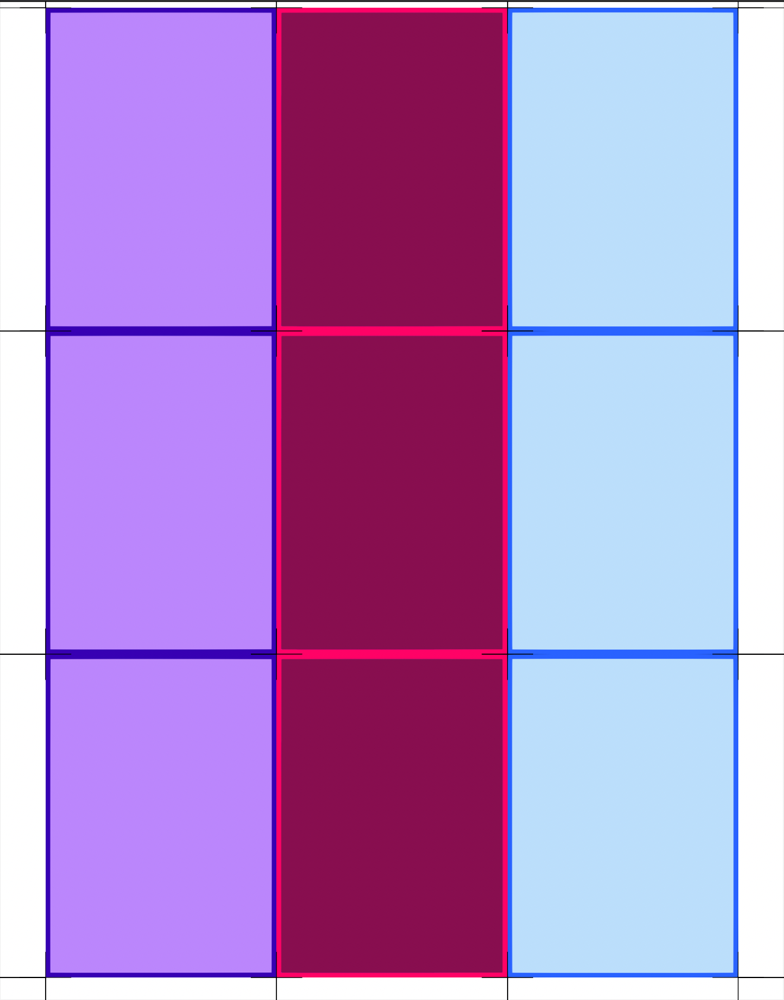
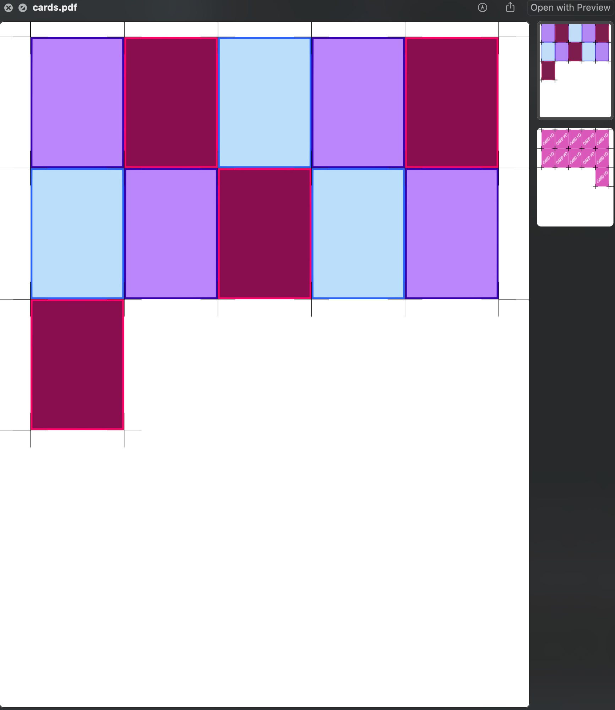

# Cards

[](https://github.com/Chuntttttt/Cards/actions/workflows/macos.yaml) [](https://github.com/Chuntttttt/Cards/actions/workflows/windows.yaml) [](https://github.com/Chuntttttt/Cards/actions/workflows/ubuntu.yaml) [](https://opensource.org/licenses/MIT)

A Rust library and CLI tool that converts directories of card images into printable PDFs with cutting guidelines. Written using MIT-licensed [printpdf](https://github.com/fschutt/printpdf) for PDF generation.

## Features

- 📦 **Library and CLI**: Use as a Rust library or standalone command-line tool
- 🎴 **Card layouts**: Configurable grid sizes (3×3, 5×5, etc.)
- ✂️ **Cutting guides**: Automatic crosshairs and edge lines for precise cutting
- 🔄 **Double-sided printing**: Back cards automatically aligned for flipping
- 🖼️ **Multiple formats**: Supports PNG, JPG, and JPEG images
- 📄 **Letter size**: Generates standard 8.5×11 inch PDFs

## Installation

### CLI Tool

#### Download Pre-built Executables

Download the latest release for your platform from the [Releases](https://github.com/Chuntttttt/Cards/releases) page. No dependencies required!

#### Build from Source

Requires Rust 1.70+ and Cargo:

```bash
# Clone the repository
git clone https://github.com/Chuntttttt/Cards.git
cd Cards

# Build release binary
cargo build --release

# The executable will be at ./target/release/cards
# Or run directly with:
cargo run --release -p cards-cli -- --help
```

### Library

Add to your `Cargo.toml`:

```toml
[dependencies]
cards-core = { git = "https://github.com/Chuntttttt/Cards.git" }
```

Or use a local path:

```toml
[dependencies]
cards-core = { path = "../Cards/cards-core" }
```

## Usage

### CLI Tool

Cards turns a folder structure like this:

```
cards/
      front/
            card_01.png
            card_02.png
            ...
            card_50.png
      back/
            back_01.png
            back_02.png
            ...
            back_50.png
```

Into a PDF with cutting guidelines and interleaved front/back cards for double-sided printing.

The card images should be 2.5x3.5 (poker card ratio). You can set the number of rows/columns by
passing the `--sides` argument (defaults to 3x3 on each page).

If there are more front cards than back cards, the last back card will be duplicated for the
remaining unmatched front cards.

#### Command Line Options

```bash
cards --cards-path <PATH> [OPTIONS]

Options:
  -c, --cards-path <PATH>   Path to the folder containing card images (required)
  -o, --output <FILE>       Output PDF filename [default: cards.pdf]
  -s, --sides <N>           Grid size (e.g., 3 for 3x3) [default: 3]
  -v, --verbose             Show progress messages
  -h, --help                Print help
```

#### Example Invocations

```bash
# Generate 3x3 grid PDF
./target/release/cards --cards-path path/to/cards --output cards.pdf

# Generate 5x5 grid PDF with verbose output
./target/release/cards --cards-path path/to/cards --output cards.pdf --sides 5 --verbose
```

### Library Usage

#### Generate PDF File

```rust
use cards_core::CardWriter;

fn main() -> Result<(), Box<dyn std::error::Error>> {
    let writer = CardWriter::new("path/to/cards".to_string(), 3);
    writer.create_pdf("output.pdf")?;
    println!("PDF created successfully!");
    Ok(())
}
```

#### Generate PDF as Bytes (for web services)

```rust
use cards_core::CardWriter;

fn generate_pdf_response(cards_path: String) -> Result<Vec<u8>, cards_core::CardsError> {
    let writer = CardWriter::new(cards_path, 3);
    let pdf_bytes = writer.generate_pdf_bytes()?;
    Ok(pdf_bytes)
}
```

#### With Logging

```rust
use cards_core::CardWriter;

fn main() -> Result<(), Box<dyn std::error::Error>> {
    // Configure logging (optional)
    env_logger::init();

    let writer = CardWriter::new("path/to/cards".to_string(), 3);
    writer.create_pdf("output.pdf")?;
    Ok(())
}
```

#### Error Handling

```rust
use cards_core::{CardWriter, CardsError};

fn create_cards() -> Result<(), CardsError> {
    let writer = CardWriter::new("path/to/cards".to_string(), 3);

    match writer.create_pdf("output.pdf") {
        Ok(_) => println!("Success!"),
        Err(CardsError::DirectoryNotFound(path)) => {
            eprintln!("Directory not found: {}", path);
        },
        Err(CardsError::ImageDecodeError(msg)) => {
            eprintln!("Failed to decode image: {}", msg);
        },
        Err(e) => eprintln!("Error: {}", e),
    }

    Ok(())
}
```

### Example Outputs




